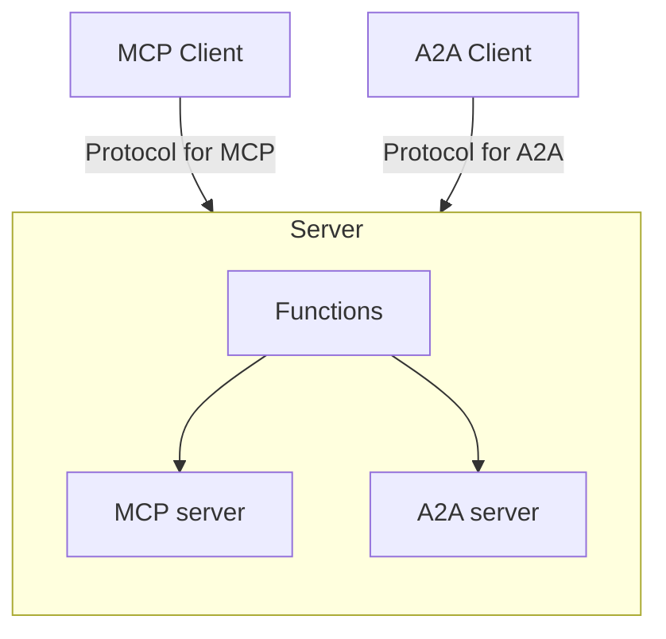
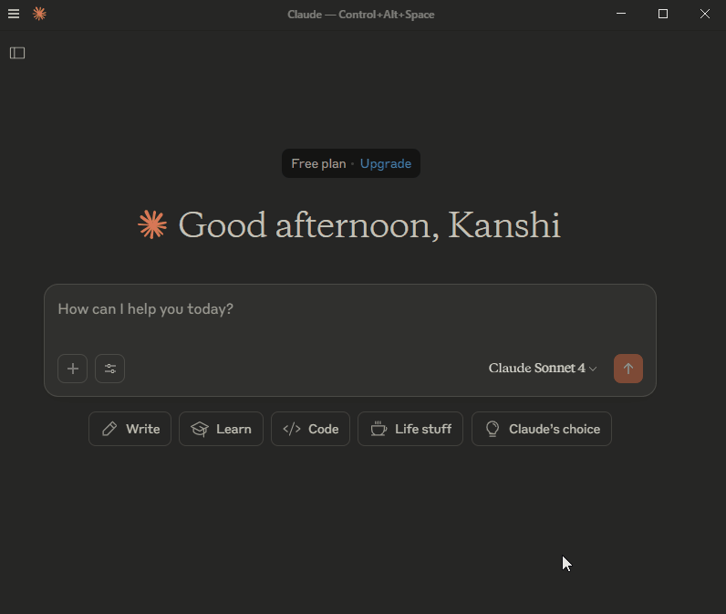
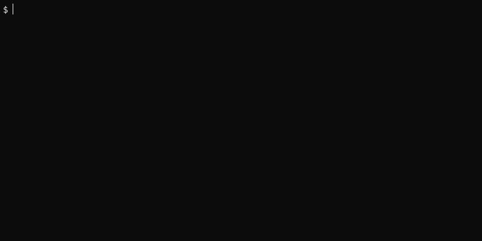

[](https://mseep.ai/app/tanaikech-consolidating-generative-ai-protocols-a-single-server-solution-for-mcp-and-a2a)

<a name="top"></a>
[](LICENCE)

# Consolidating Generative AI Protocols: A Single Server Solution for MCP and A2A


# Abstract

A new unified Google Apps Script now deploys both Model Context Protocol (MCP) and Agent2Agent (A2A) networks as a single server, streamlining AI model integration for Google Workspace users.

# Introduction

The rapid growth of generative AI has led to increasing integration between AI models, exemplified by protocols like the Model Context Protocol (MCP) and Agent2Agent (A2A) Protocol. Recently, I released MCPApp and A2AApp, which establish the MCP and A2A networks using Google Apps Script. [Ref](https://medium.com/google-cloud/gmail-processing-using-mcp-network-powered-by-google-apps-script-5ede2a25c94e) and [Ref](https://medium.com/google-cloud/enabling-collaborative-agent-systems-through-google-apps-script-based-agent2agent-a2a-network-19e3d0472eaa) This approach offers significant advantages for users of Google Workspace and Google APIs, as it enables seamless authorization and integration of these resources directly within the applications.

Traditionally, deploying separate MCP and A2A servers required setting up and developing two distinct projects. This report addresses that inefficiency by presenting a unified script capable of creating both the MCP and A2A servers as a single, integrated server. This consolidation allows both MCP and A2A clients to access a common server, streamlining operations. Furthermore, it facilitates the sharing of common functions between the MCP and A2A servers, significantly reducing development costs and enhancing overall efficiency.

# Flow

The flow chart of this is as follows.



# Repository

[https://github.com/tanaikech/Consolidating-Generative-AI-Protocols-A-Single-Server-Solution-for-MCP-and-A2A](https://github.com/tanaikech/Consolidating-Generative-AI-Protocols-A-Single-Server-Solution-for-MCP-and-A2A)

# Usage

## 1. Ger API key

In order to use the scripts in this report, please use your API key. [Ref](https://ai.google.dev/gemini-api/docs/api-key) This API key is used to access the Gemini API.

## 2. Copy demo script

You can copy the demo script using the following Google Apps Script. Please copy and paste the following script into the script editor of Google Apps Script and run the function `myFunction`. By this, the demo Google Apps Script project is copied to the root folder of your Google Drive.

```javascript
function myFunction() {
  const fileId = "1N1eg3vEgi_eVAiPB1SrPG9NIfEEQ5qohZED9haQQ7VbOKnMfLkPkYkUe";
  const file = DriveApp.getFileById(fileId);
  file.makeCopy(file.getName());
}
```

Of course, you can also directly copy and paste the script from the repository. [GitHub](https://github.com/tanaikech/Consolidating-Generative-AI-Protocols-A-Single-Server-Solution-for-MCP-and-A2A)

## 3. Deploy Web Apps

To allow access from both the MCP and A2A clients, the project uses Web Apps built with Google Apps Script as the server. Both clients can access this server using HTTP GET and HTTP POST requests. Thus, the Web Apps can serve as a unified server, integrating the MCP and A2A functionalities.

Detailed information can be found in [the official documentation](https://developers.google.com/apps-script/guides/web#deploy_a_script_as_a_web_app).

Please follow these steps to deploy the Web App in the script editor.

1. In the script editor, at the top right, click "Deploy" -> "New deployment".
2. Click "Select type" -> "Web App".
3. Enter the information about the Web App in the fields under "Deployment configuration".
4. Select **"Me"** for **"Execute as"**.
5. Select **"Anyone"** for **"Who has access to the app:"**.
6. Click "Deploy".
7. On the script editor, at the top right, click "Deploy" -> "Test deployments".
8. Copy the Web App URL. It will be similar to `https://script.google.com/macros/s/###/exec`. This URL is used to the MCP client and the A2A server.
9. Please run the function `getRegisteringAgentCardURL()` in the copied script, and copy the showing URL on the console. This URL is used to the A2A client.

**It is important to note that when you modify the Google Apps Script for the Web App, you must modify the deployment as a new version.** This ensures the modified script is reflected in the Web App. Please be careful about this. Also, you can find more details on this in my report "[Redeploying Web Apps without Changing URL of Web Apps for new IDE](https://gist.github.com/tanaikech/ebf92d8f427d02d53989d6c3464a9c43)".

## 4. Update copied script

When you copied the file, please open it. By the script editor is opened. Please do the following modifications.

- Set your API key to `apiKey`.
- Set the Web Apps URL like `https://script.google.com/macros/s/###/exec` to the URL of `agentCard
`. At that time, please add a query parameter of `accessKey=sample`. So, the URL becomes `https://script.google.com/macros/s/###/exec?accessKey=sample`

## 5. Testing

### MCP client

As the MCP client, Claude Desktop is used. [Ref](https://claude.ai/download) In this case, the `claude_desktop_config.json` is configured as follows. Please replace `https://script.google.com/macros/s/###/exec` with your Web App URL.

```json
{
  "mcpServers": {
    "gas_web_apps": {
      "command": "npx",
      "args": [
        "mcp-remote",
        "https://script.google.com/macros/s/###/exec?accessKey=sample"
      ]
    }
  }
}
```

Please close and open Claude Desktop again. The result can be seen at the following demonstration.



You can see that the MCP client of Claude Desktop can use the server that integrates the MCP server and the A2A server built by Google Apps Script.

### A2A client

As the A2A client, `@a2a-js/sdk` is used. [Ref](https://github.com/google-a2a/a2a-js) In this case, in order to test the script using `@a2a-js/sdk`, it is required to modify `@a2a-js/sdk`. Please modify the function `_fetchAndCacheAgentCard` of `node_modules/@a2a-js/sdk/build/src/client/client.js` as follows.

To request Google Apps Script Web Apps with the path `/.well-known/agent.json`, an access token is required [Ref](https://github.com/tanaikech/taking-advantage-of-Web-Apps-with-google-apps-script?tab=readme-ov-file#pathinfo-updated-on-february-14-2023). This access token is used as a query parameter. However, most current A2A client specifications do not support this. Therefore, the following modification is necessary.

Additionally, requesting Web Apps requires a redirect [Ref](https://github.com/tanaikech/taking-advantage-of-Web-Apps-with-google-apps-script?tab=readme-ov-file#understanding-flow-of-request-to-web-apps-created-by-google-apps-script). Unfortunately, the public A2A client for Python does not support redirects. In contrast, Node.js supports redirects by default. For these reasons, `@a2a-js/sdk` was chosen as the sample for this report.

**From**

```javascript
const agentCardUrl = `${this.agentBaseUrl}/.well-known/agent.json`;
```

**To**

```javascript
const agentCardUrl = ((agentBaseUrl) => {
  /**
   * ### Description
   * This method is used for parsing the URL including the query parameters.
   * Ref: https://tanaikech.github.io/2018/07/12/adding-query-parameters-to-url-using-google-apps-script/
   *
   * @param {String} url The URL including the query parameters.
   * @return {Object} JSON object including the base url and the query parameters.
   */
  function parseQueryParameters(url) {
    if (url === null || typeof url != "string") {
      throw new Error(
        "Please give URL (String) including the query parameters."
      );
    }
    const s = url.split("?");
    if (s.length == 1) {
      return { url: s[0], queryParameters: null };
    }
    const [baseUrl, query] = s;
    if (query) {
      const queryParameters = query.split("&").reduce(function (o, e) {
        const temp = e.split("=");
        const key = temp[0].trim();
        let value = temp[1].trim();
        value = isNaN(value) ? value : Number(value);
        if (o[key]) {
          o[key].push(value);
        } else {
          o[key] = [value];
        }
        return o;
      }, {});
      return { url: baseUrl, queryParameters };
    }
    return null;
  }

  /**
   * ### Description
   * This method is used for adding the query parameters to the URL.
   * Ref: https://tanaikech.github.io/2018/07/12/adding-query-parameters-to-url-using-google-apps-script/
   *
   * @param {String} url The base URL for adding the query parameters.
   * @param {Object} obj JSON object including query parameters.
   * @return {String} URL including the query parameters.
   */
  function addQueryParameters(url, obj) {
    if (url === null || obj === null || typeof url != "string") {
      throw new Error(
        "Please give URL (String) and query parameter (JSON object)."
      );
    }
    const o = Object.entries(obj);
    return (
      (url == "" ? "" : `${url}${o.length > 0 ? "?" : ""}`) +
      o
        .flatMap(([k, v]) =>
          Array.isArray(v)
            ? v.map((e) => `${k}=${encodeURIComponent(e)}`)
            : `${k}=${encodeURIComponent(v)}`
        )
        .join("&")
    );
  }

  const urlObj = parseQueryParameters(agentBaseUrl);
  return addQueryParameters(
    `${urlObj.url}/.well-known/agent.json`,
    urlObj.queryParameters
  );
})(this.agentBaseUrl);
```

The sample script of the A2A client is as follows. Please replace `https://script.google.com/macros/s/###/dev?access_token=###&accessKey=sample` with your URL retrieved by the function `getRegisteringAgentCardURL()` in the copied script.

```javascript
import {
  A2AClient,
  Message,
  MessageSendParams,
  SendMessageResponse,
  SendMessageSuccessResponse,
} from "@a2a-js/sdk";
import { v4 as uuidv4 } from "uuid";

// Please set your A2A server URL.
const agentBaseUrl = "https://script.google.com/macros/s/###/dev?access_token=###&accessKey=sample";

// Sample prompts for testing the above A2A server.
const prompts = [
  "How much is 10 yen in USD?",
  "What is the weather forecast for Tokyo at noon today?",
];

async function run(prompts: Array<string>) {
  const client = new A2AClient(agentBaseUrl);
  for (let prompt of prompts) {
    const messageId = uuidv4();
    const sendParams: MessageSendParams = {
      message: {
        messageId: messageId,
        role: "user",
        parts: [{ kind: "text", text: prompt }],
        kind: "message",
      },
      configuration: {
        blocking: true,
        acceptedOutputModes: ["text/plain"],
      },
    };
    const sendResponse: SendMessageResponse = await client.sendMessage(
      sendParams
    );
    const result = (sendResponse as SendMessageSuccessResponse).result;
    const messageResult = result as Message;
    messageResult.parts.forEach((e) => {
      if (e.kind == "text") {
        console.log(`Prompt: ${prompt}`);
        console.log(`Response: ${e.text}`);
      }
    });
  }
}

run(prompts);
```

When this script is run, the following result can be obtained.



You can see that the A2A client created by `@a2a-js/sdk` can use the server that integrates the MCP server and the A2A server built by Google Apps Script.

# IMPORTANT

- If an error occurs, please redeploy the Web Apps to reflect the latest script. **It is important to note that when you modify the Google Apps Script for the Web App, you must modify the deployment as a new version.** This ensures the modified script is reflected in the Web App. Please be careful about this. Also, you can find more details on this in my report "[Redeploying Web Apps without Changing URL of Web Apps for new IDE](https://gist.github.com/tanaikech/ebf92d8f427d02d53989d6c3464a9c43)".

# Summary

- A new unified Google Apps Script was developed to deploy both Model Context Protocol (MCP) and Agent2Agent (A2A) networks as a single server.
- This consolidated approach addressed the inefficiency of traditional deployments, which required separate projects for MCP and A2A servers.
- The unified server allowed both MCP and A2A clients to access a common server, which streamlined operations and facilitated the sharing of common functions, thereby reducing development costs.
- The server utilized Web Apps built with Google Apps Script to handle HTTP GET and HTTP POST requests from both MCP and A2A clients.
- Demonstrations using Claude Desktop as an MCP client and `@a2a-js/sdk` as an A2A client successfully showed that the integrated Google Apps Script server functioned correctly for both protocols.

---

<a name="licence"></a>

# Licence

[MIT](LICENCE)

<a name="author"></a>

# Author

[Tanaike](https://tanaikech.github.io/about/)

[Donate](https://tanaikech.github.io/donate/)

<a name="updatehistory"></a>

# Update History

- v1.0.0 (June 19, 2025)

  1. Initial release.

[TOP](#top)
